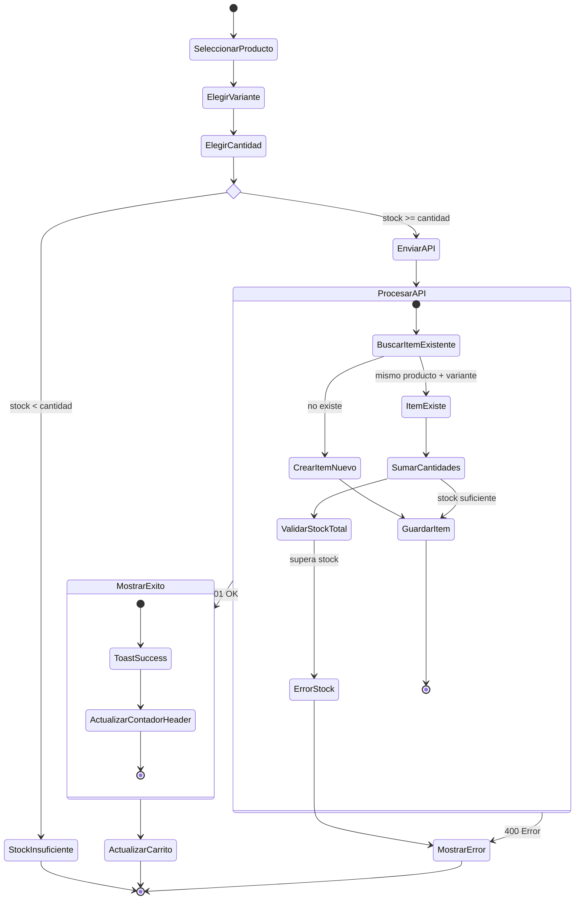
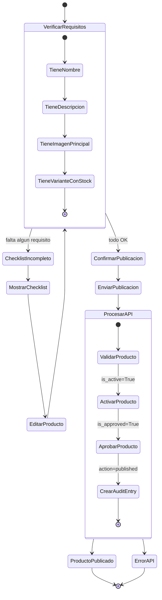
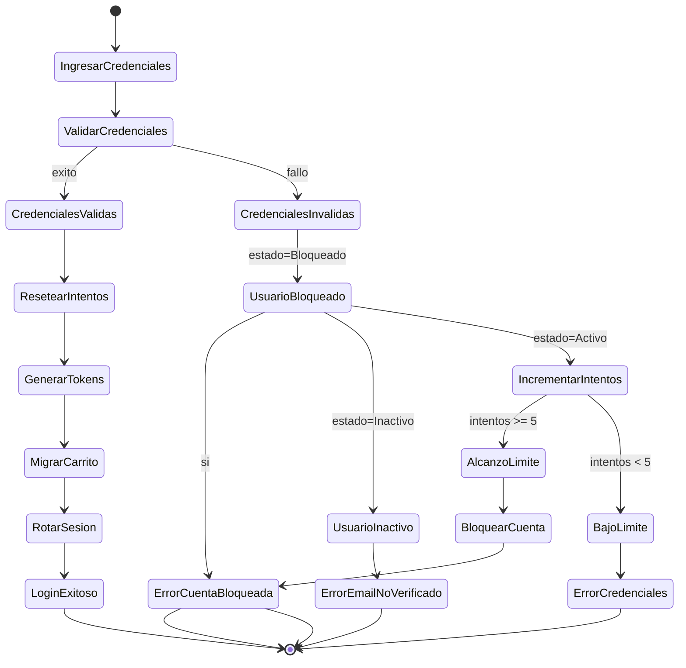

# Diagrama de Actividades

## 12.1 Actividad: Agregar Producto al Carrito

## 12.2 Actividad: Publicacion de Producto (Administrador)

## 12.3 Actividad: Autenticacion y Bloqueo por Intentos Fallidos

