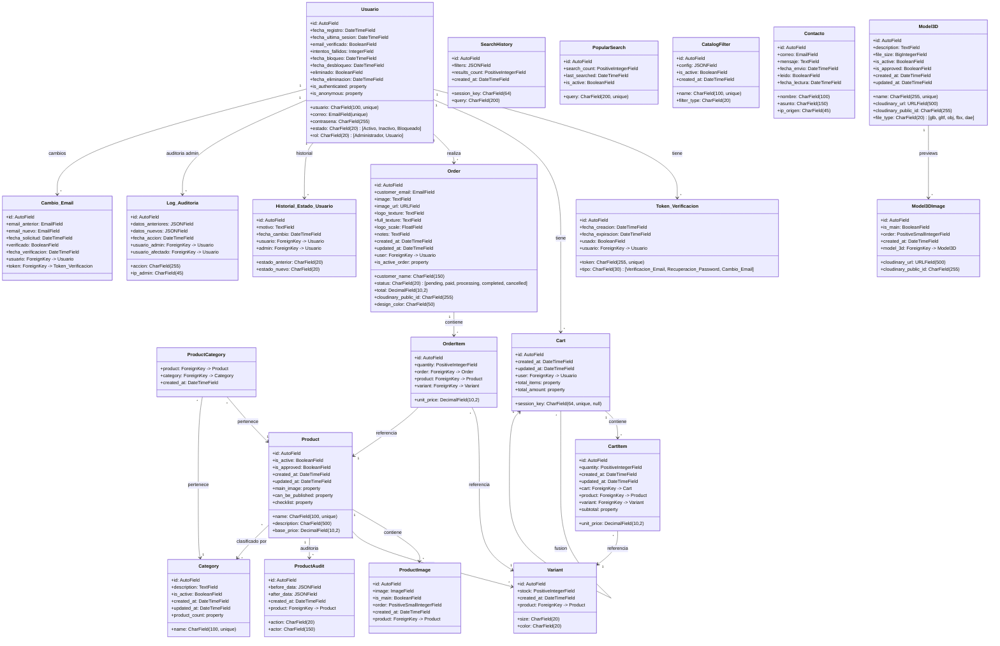

# Diagrama de Clases

## 10.1 Diagrama de Clases del Backend (Modelos Django)

```mermaid
classDiagram
    %% Modulo Usuarios
    class Usuario {
        +id: AutoField
        +usuario: CharField(100, unique)
        +correo: EmailField(unique)
        +contrasena: CharField(255)
        +estado: CharField(20) [Activo, Inactivo, Bloqueado]
        +rol: CharField(20) [Administrador, Usuario]
        +fecha_registro: DateTimeField
        +fecha_ultima_sesion: DateTimeField
        +email_verificado: BooleanField
        +intentos_fallidos: IntegerField
        +fecha_bloqueo: DateTimeField
        +fecha_desbloqueo: DateTimeField
        +eliminado: BooleanField
        +fecha_eliminacion: DateTimeField
        +is_authenticated: property
        +is_anonymous: property
    }
    
    class Token_Verificacion {
        +id: AutoField
        +token: CharField(255, unique)
        +tipo: CharField(30) [Verificacion_Email, Recuperacion_Password, Cambio_Email]
        +fecha_creacion: DateTimeField
        +fecha_expiracion: DateTimeField
        +usado: BooleanField
        +usuario: ForeignKey -> Usuario
    }
    
    class Cambio_Email {
        +id: AutoField
        +email_anterior: EmailField
        +email_nuevo: EmailField
        +fecha_solicitud: DateTimeField
        +verificado: BooleanField
        +fecha_verificacion: DateTimeField
        +usuario: ForeignKey -> Usuario
        +token: ForeignKey -> Token_Verificacion
    }
    
    class Historial_Estado_Usuario {
        +id: AutoField
        +estado_anterior: CharField(20)
        +estado_nuevo: CharField(20)
        +motivo: TextField
        +fecha_cambio: DateTimeField
        +usuario: ForeignKey -> Usuario
        +admin: ForeignKey -> Usuario
    }
    
    class Log_Auditoria {
        +id: AutoField
        +accion: CharField(255)
        +datos_anteriores: JSONField
        +datos_nuevos: JSONField
        +fecha_accion: DateTimeField
        +ip_admin: CharField(45)
        +usuario_admin: ForeignKey -> Usuario
        +usuario_afectado: ForeignKey -> Usuario
    }
    
    %% Modulo Productos
    class Product {
        +id: AutoField
        +name: CharField(100, unique)
        +description: CharField(500)
        +base_price: DecimalField(10,2)
        +is_active: BooleanField
        +is_approved: BooleanField
        +created_at: DateTimeField
        +updated_at: DateTimeField
        +main_image: property
        +can_be_published: property
        +checklist: property
    }
    
    class ProductImage {
        +id: AutoField
        +image: ImageField
        +is_main: BooleanField
        +order: PositiveSmallIntegerField
        +created_at: DateTimeField
        +product: ForeignKey -> Product
    }
    
    class Variant {
        +id: AutoField
        +size: CharField(20)
        +color: CharField(20)
        +stock: PositiveIntegerField
        +created_at: DateTimeField
        +product: ForeignKey -> Product
    }
    
    class ProductAudit {
        +id: AutoField
        +action: CharField(20)
        +actor: CharField(150)
        +before_data: JSONField
        +after_data: JSONField
        +created_at: DateTimeField
        +product: ForeignKey -> Product
    }
    
    %% Modulo Catalog
    class Category {
        +id: AutoField
        +name: CharField(100, unique)
        +description: TextField
        +is_active: BooleanField
        +created_at: DateTimeField
        +updated_at: DateTimeField
        +product_count: property
    }
    
    class ProductCategory {
        +product: ForeignKey -> Product
        +category: ForeignKey -> Category
        +created_at: DateTimeField
    }
    
    class SearchHistory {
        +id: AutoField
        +session_key: CharField(64)
        +query: CharField(200)
        +filters: JSONField
        +results_count: PositiveIntegerField
        +created_at: DateTimeField
    }
    
    class PopularSearch {
        +id: AutoField
        +query: CharField(200, unique)
        +search_count: PositiveIntegerField
        +last_searched: DateTimeField
        +is_active: BooleanField
    }
    
    class CatalogFilter {
        +id: AutoField
        +name: CharField(100, unique)
        +filter_type: CharField(20)
        +config: JSONField
        +is_active: BooleanField
        +created_at: DateTimeField
    }
    
    %% Modulo Carts
    class Cart {
        +id: AutoField
        +session_key: CharField(64, unique, null)
        +created_at: DateTimeField
        +updated_at: DateTimeField
        +user: ForeignKey -> Usuario
        +total_items: property
        +total_amount: property
    }
    
    class CartItem {
        +id: AutoField
        +quantity: PositiveIntegerField
        +unit_price: DecimalField(10,2)
        +created_at: DateTimeField
        +updated_at: DateTimeField
        +cart: ForeignKey -> Cart
        +product: ForeignKey -> Product
        +variant: ForeignKey -> Variant
        +subtotal: property
    }
    
    %% Modulo Orders
    class Order {
        +id: AutoField
        +customer_name: CharField(150)
        +customer_email: EmailField
        +status: CharField(20) [pending, paid, processing, completed, cancelled]
        +total: DecimalField(10,2)
        +image: TextField
        +image_url: URLField
        +cloudinary_public_id: CharField(255)
        +design_color: CharField(50)
        +logo_texture: TextField
        +full_texture: TextField
        +logo_scale: FloatField
        +notes: TextField
        +created_at: DateTimeField
        +updated_at: DateTimeField
        +user: ForeignKey -> Usuario
        +is_active_order: property
    }
    
    class OrderItem {
        +id: AutoField
        +quantity: PositiveIntegerField
        +unit_price: DecimalField(10,2)
        +order: ForeignKey -> Order
        +product: ForeignKey -> Product
        +variant: ForeignKey -> Variant
    }
    
    %% Modulo Contacto
    class Contacto {
        +id: AutoField
        +nombre: CharField(100)
        +correo: EmailField
        +asunto: CharField(150)
        +mensaje: TextField
        +ip_origen: CharField(45)
        +fecha_envio: DateTimeField
        +leido: BooleanField
        +fecha_lectura: DateTimeField
    }
    
    %% Modulo Models3D
    class Model3D {
        +id: AutoField
        +name: CharField(255, unique)
        +description: TextField
        +cloudinary_url: URLField(500)
        +cloudinary_public_id: CharField(255)
        +file_type: CharField(20) [glb, gltf, obj, fbx, dae]
        +file_size: BigIntegerField
        +is_active: BooleanField
        +is_approved: BooleanField
        +created_at: DateTimeField
        +updated_at: DateTimeField
    }
    
    class Model3DImage {
        +id: AutoField
        +cloudinary_url: URLField(500)
        +cloudinary_public_id: CharField(255)
        +is_main: BooleanField
        +order: PositiveSmallIntegerField
        +created_at: DateTimeField
        +model_3d: ForeignKey -> Model3D
    }
    
    %% Relaciones
    Usuario "1" --> "*" Token_Verificacion : tiene
    Usuario "1" --> "*" Cart : tiene
    Usuario "1" --> "*" Order : realiza
    Usuario "1" --> "*" Historial_Estado_Usuario : historial
    Usuario "1" --> "*" Log_Auditoria : auditoria admin
    Usuario "1" --> "*" Cambio_Email : cambios
    
    Product "1" --> "*" ProductImage : contiene
    Product "1" --> "*" Variant : tiene
    Product "1" --> "*" ProductAudit : auditoria
    Product "*" --> "*" Category : clasificado por
    ProductCategory "*" --> "1" Product : pertenece
    ProductCategory "*" --> "1" Category : pertenece
    
    Cart "1" --> "*" CartItem : contiene
    Cart "*" --> "1" Cart : fusion
    CartItem "*" --> "1" Variant : referencia
    
    Order "1" --> "*" OrderItem : contiene
    OrderItem "*" --> "1" Variant : referencia
    OrderItem "*" --> "1" Product : referencia
    
    Model3D "1" --> "*" Model3DImage : previews
```
