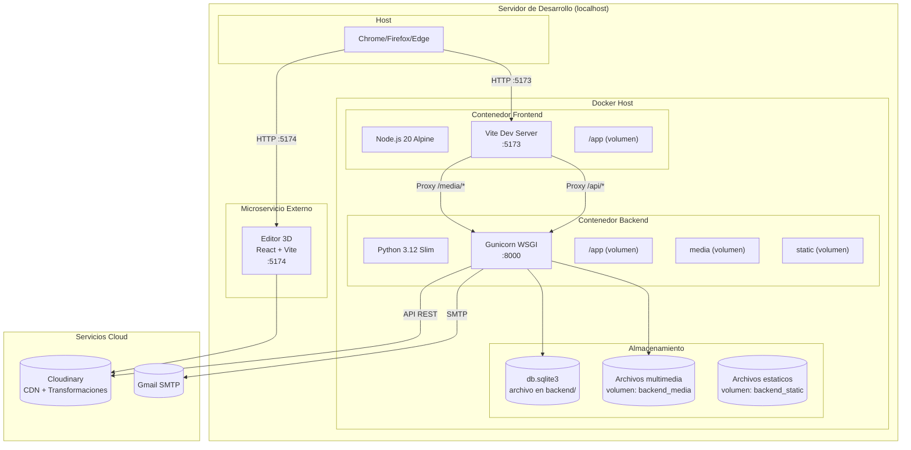
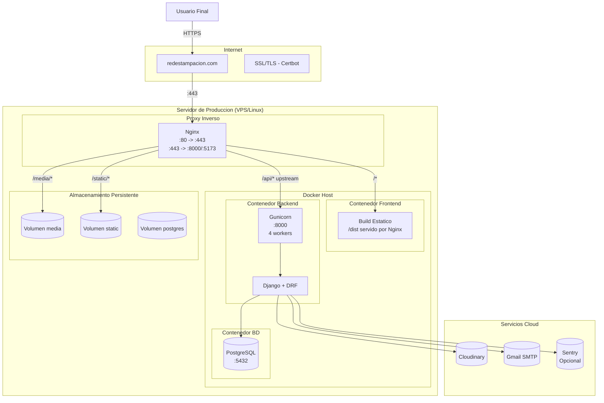
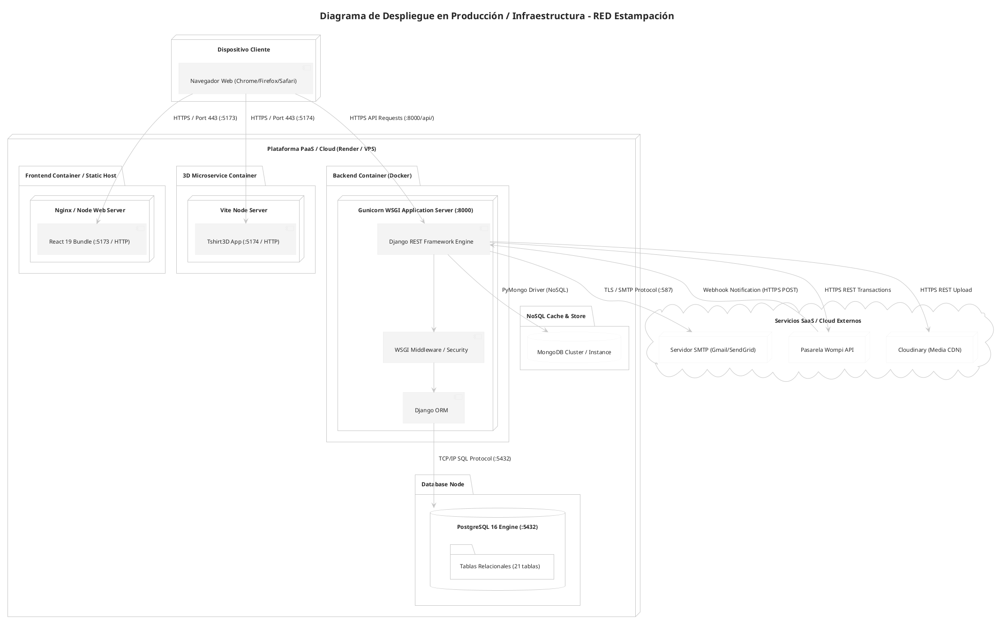

# Diagrama de Despliegue

## 14.1 Diagrama de Despliegue (Entorno de Desarrollo)

## 14.2 Diagrama de Despliegue (Entorno de Produccion Propuesto)

## 14.4 Diagrama de Despliegue en PlantUML (.puml)

El archivo de especificación PlantUML para el entorno de despliegue e infraestructura se encuentra en [`docs/04-diseno-uml/despliegue-proyecto.puml`](file:///home/South_Knight/Documentos/projecto_final/projecto_formativo/docs/04-diseno-uml/despliegue-proyecto.puml) y su imagen renderizada en [`docs/04-diseno-uml/arquitectura_despliegue_red.png`](file:///home/South_Knight/Documentos/projecto_final/projecto_formativo/docs/04-diseno-uml/arquitectura_despliegue_red.png):

