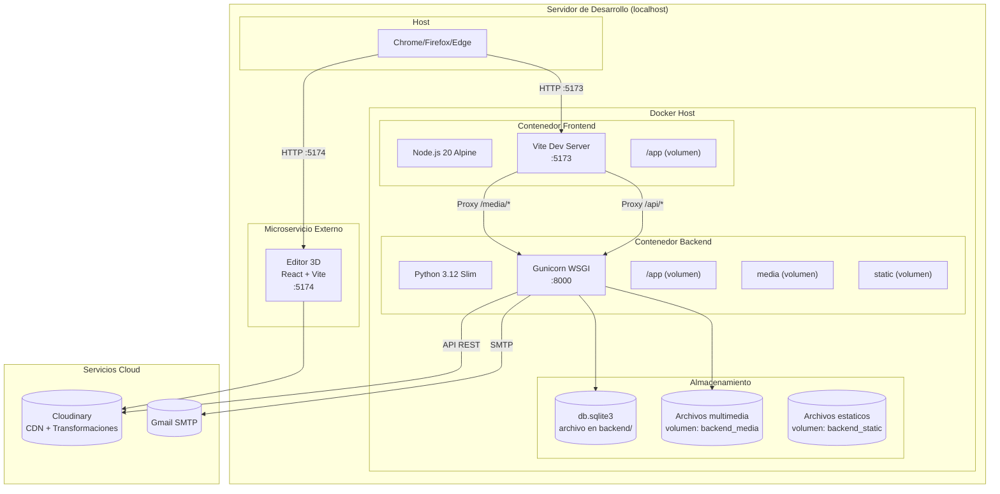
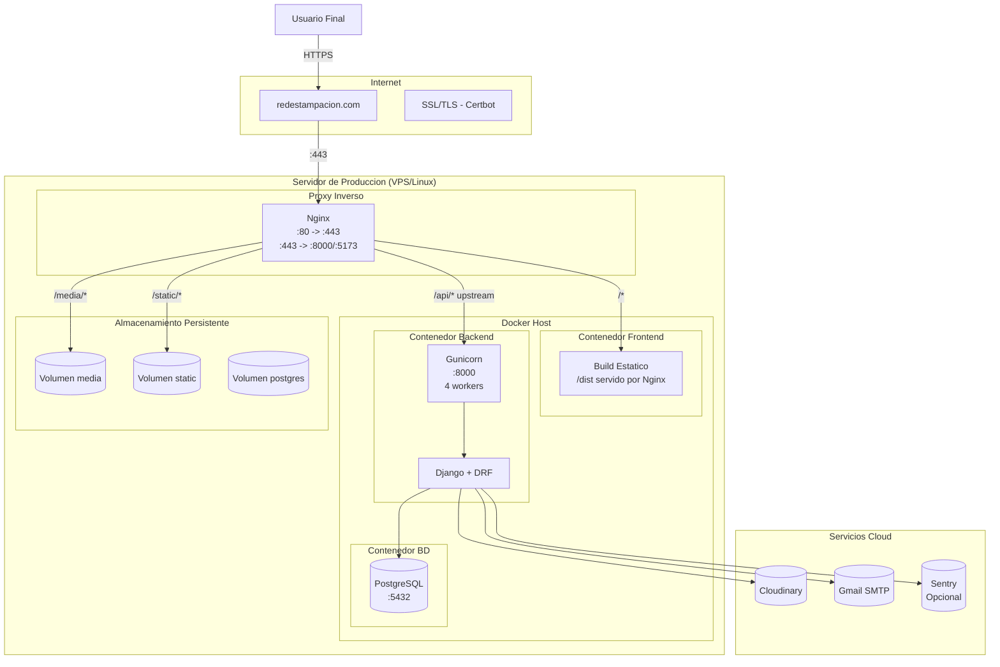

# Diagrama de Despliegue

## 14.1 Diagrama de Despliegue (Entorno de Desarrollo)

## 14.2 Diagrama de Despliegue (Entorno de Produccion Propuesto)

## 14.3 Requisitos de Hardware (Produccion)

| Recurso | Minimo | Recomendado |
|---------|--------|-------------|
| CPU | 2 vCPUs | 4 vCPUs |
| RAM | 2 GB | 4 GB |
| Disco | 20 GB | 50 GB SSD |
| SO | Ubuntu 22.04 / Debian 12 | Ubuntu 24.04 LTS |
| Docker | 24+ | 25+ |
| Docker Compose | 2.20+ | 2.30+ |
