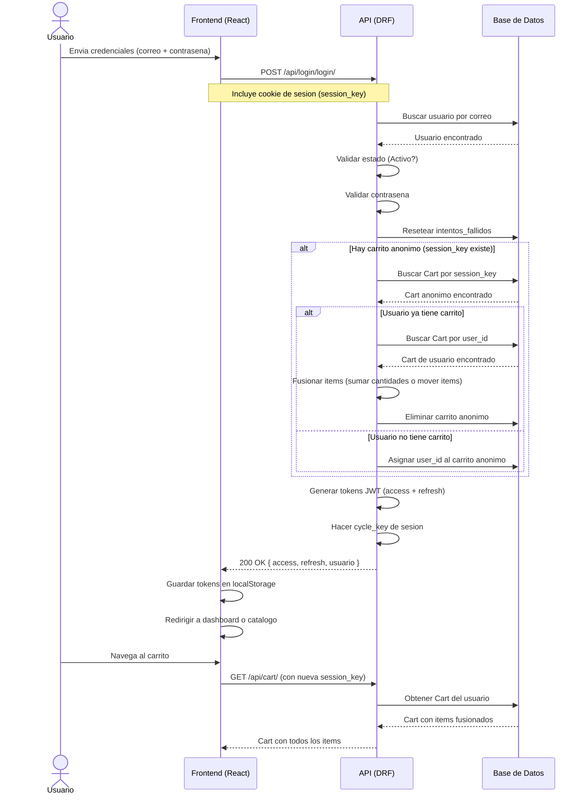
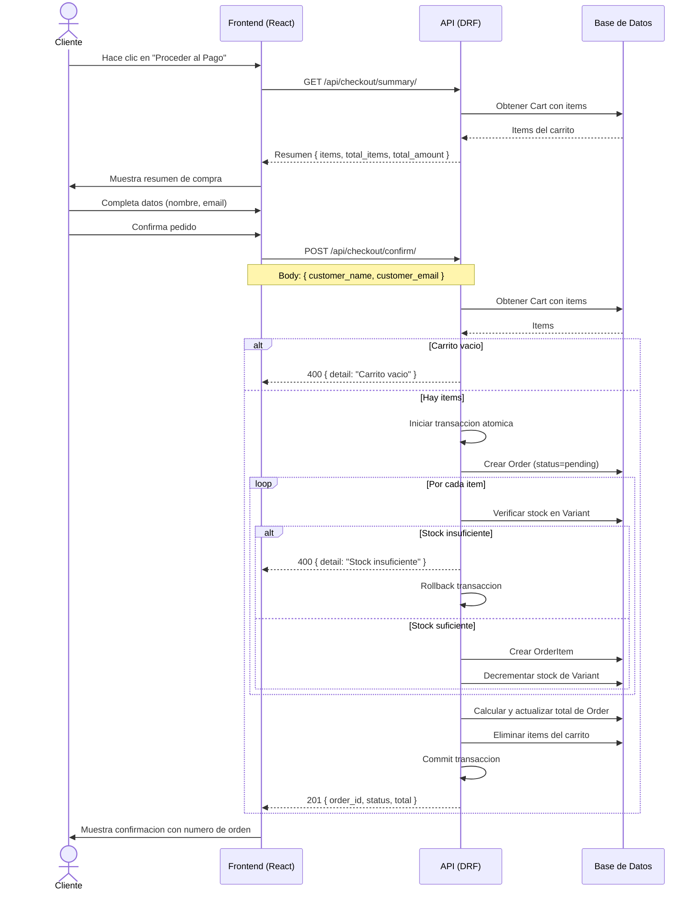
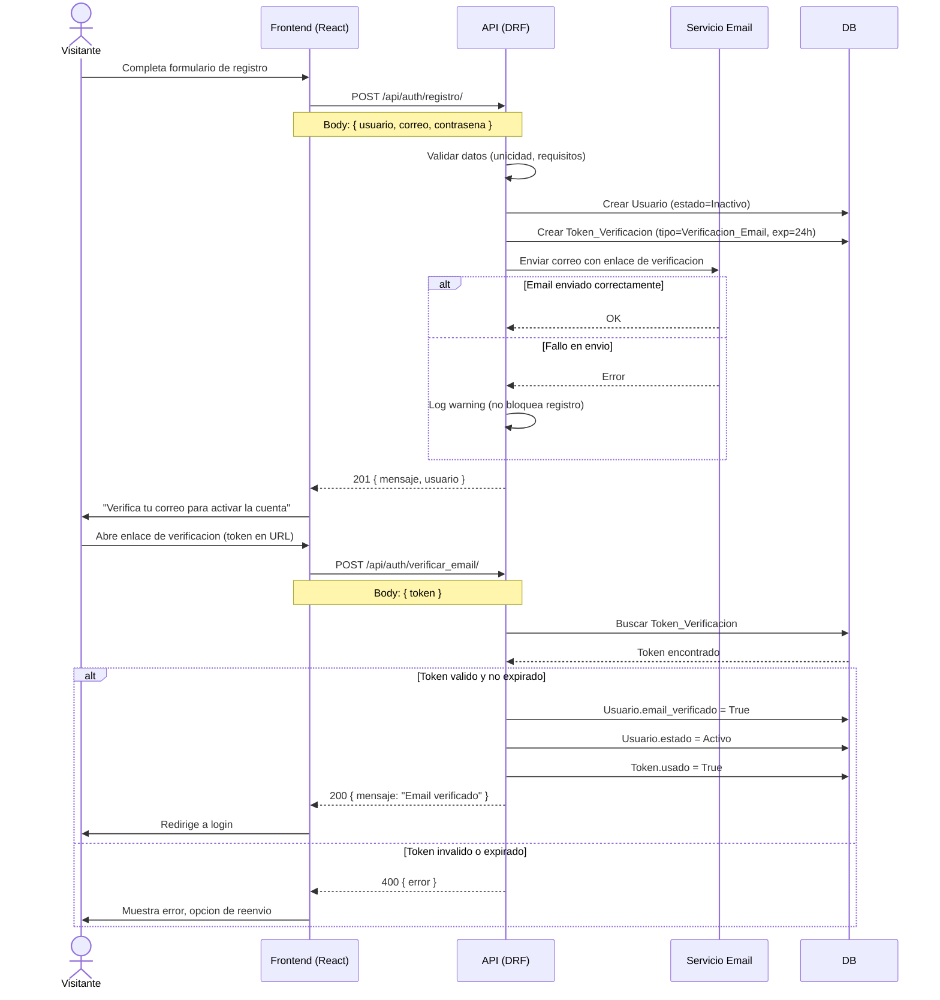

# Diagrama de Secuencia

## 11.1 Secuencia: Inicio de Sesion con Fusion de Carrito

```mermaid
sequenceDiagram
    actor Usuario
    participant Frontend as Frontend (React)
    participant API as API (DRF)
    participant DB as Base de Datos
    
    Usuario->>Frontend: Envia credenciales (correo + contrasena)
    Frontend->>API: POST /api/login/login/
    Note over Frontend,API: Incluye cookie de sesion (session_key)
    
    API->>DB: Buscar usuario por correo
    DB-->>API: Usuario encontrado
    
    API->>API: Validar estado (Activo?)
    API->>API: Validar contrasena
    API->>DB: Resetear intentos_fallidos
    
    alt Hay carrito anonimo (session_key existe)
        API->>DB: Buscar Cart por session_key
        DB-->>API: Cart anonimo encontrado
        
        alt Usuario ya tiene carrito
            API->>DB: Buscar Cart por user_id
            DB-->>API: Cart de usuario encontrado
            API->>API: Fusionar items (sumar cantidades o mover items)
            API->>DB: Eliminar carrito anonimo
        else Usuario no tiene carrito
            API->>DB: Asignar user_id al carrito anonimo
        end
    end
    
    API->>API: Generar tokens JWT (access + refresh)
    API->>API: Hacer cycle_key de sesion
    
    API-->>Frontend: 200 OK { access, refresh, usuario }
    Frontend->>Frontend: Guardar tokens en localStorage
    Frontend->>Frontend: Redirigir a dashboard o catalogo
    
    Usuario->>Frontend: Navega al carrito
    Frontend->>API: GET /api/cart/ (con nueva session_key)
    API->>DB: Obtener Cart del usuario
    DB-->>API: Cart con items fusionados
    API-->>Frontend: Cart con todos los items
```

## 11.2 Secuencia: Proceso de Compra (Checkout)

```mermaid
sequenceDiagram
    actor Cliente
    participant Frontend as Frontend (React)
    participant API as API (DRF)
    participant DB as Base de Datos
    
    Cliente->>Frontend: Hace clic en "Proceder al Pago"
    Frontend->>API: GET /api/checkout/summary/
    API->>DB: Obtener Cart con items
    DB-->>API: Items del carrito
    API-->>Frontend: Resumen { items, total_items, total_amount }
    Frontend->>Cliente: Muestra resumen de compra
    
    Cliente->>Frontend: Completa datos (nombre, email)
    Cliente->>Frontend: Confirma pedido
    
    Frontend->>API: POST /api/checkout/confirm/
    Note over Frontend,API: Body: { customer_name, customer_email }
    
    API->>DB: Obtener Cart con items
    DB-->>API: Items
    
    alt Carrito vacio
        API-->>Frontend: 400 { detail: "Carrito vacio" }
    else Hay items
        API->>API: Iniciar transaccion atomica
        
        API->>DB: Crear Order (status=pending)
        loop Por cada item
            API->>DB: Verificar stock en Variant
            alt Stock insuficiente
                API-->>Frontend: 400 { detail: "Stock insuficiente" }
                API->>API: Rollback transaccion
            else Stock suficiente
                API->>DB: Crear OrderItem
                API->>DB: Decrementar stock de Variant
            end
        end
        
        API->>DB: Calcular y actualizar total de Order
        API->>DB: Eliminar items del carrito
        
        API->>API: Commit transaccion
        API-->>Frontend: 201 { order_id, status, total }
    end
    
    Frontend->>Cliente: Muestra confirmacion con numero de orden
```

## 11.3 Secuencia: Flujo de Registro y Verificacion

```mermaid
sequenceDiagram
    actor Visitante
    participant Frontend as Frontend (React)
    participant API as API (DRF)
    participant Email as Servicio Email
    
    Visitante->>Frontend: Completa formulario de registro
    Frontend->>API: POST /api/auth/registro/
    Note over Frontend,API: Body: { usuario, correo, contrasena }
    
    API->>API: Validar datos (unicidad, requisitos)
    API->>DB: Crear Usuario (estado=Inactivo)
    API->>DB: Crear Token_Verificacion (tipo=Verificacion_Email, exp=24h)
    
    API->>Email: Enviar correo con enlace de verificacion
    alt Email enviado correctamente
        Email-->>API: OK
    else Fallo en envio
        Email-->>API: Error
        API->>API: Log warning (no bloquea registro)
    end
    
    API-->>Frontend: 201 { mensaje, usuario }
    Frontend->>Visitante: "Verifica tu correo para activar la cuenta"
    
    Visitante->>Frontend: Abre enlace de verificacion (token en URL)
    Frontend->>API: POST /api/auth/verificar_email/
    Note over Frontend,API: Body: { token }
    
    API->>DB: Buscar Token_Verificacion
    DB-->>API: Token encontrado
    
    alt Token valido y no expirado
        API->>DB: Usuario.email_verificado = True
        API->>DB: Usuario.estado = Activo
        API->>DB: Token.usado = True
        API-->>Frontend: 200 { mensaje: "Email verificado" }
        Frontend->>Visitante: Redirige a login
    else Token invalido o expirado
        API-->>Frontend: 400 { error }
        Frontend->>Visitante: Muestra error, opcion de reenvio
    end
```
