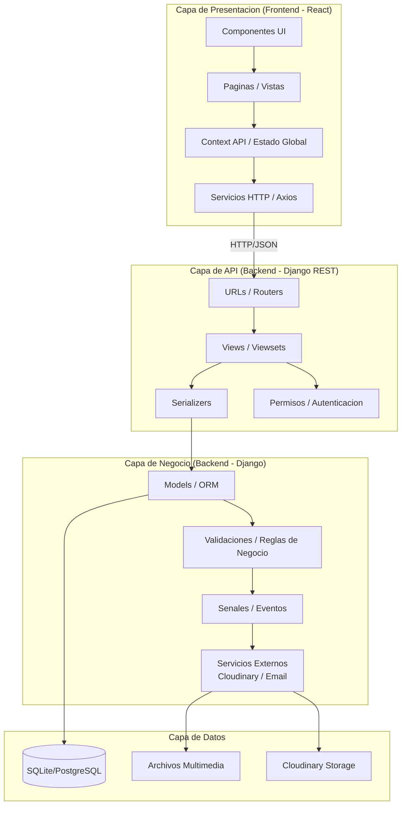
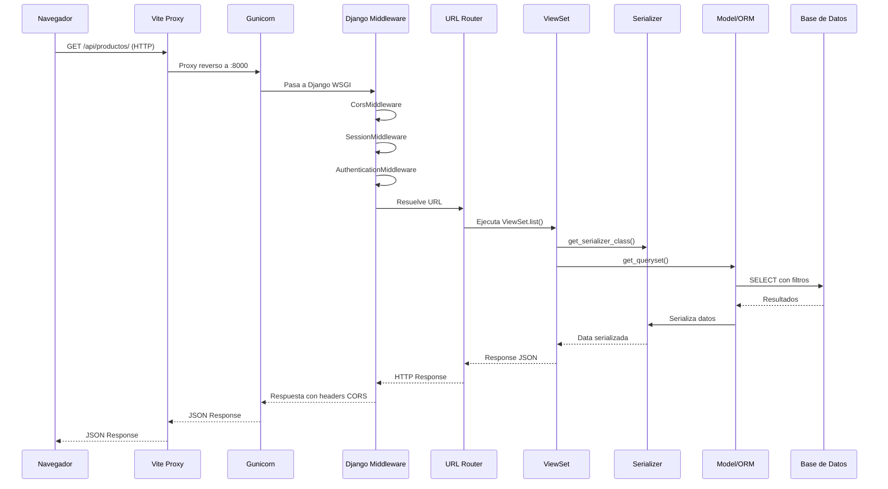

# Arquitectura General — RED Estampación

> Documento técnico de arquitectura de software del proyecto RED (Ropa con Estampados Digitales).
> Describe el estilo arquitectónico, capas, patrones, módulos, flujos de datos, integraciones,
> seguridad y despliegue. Es la fuente central de referencia de arquitectura.

**Última actualización:** Agosto 2026
**Mantenido por:** Equipo RED Estampación

---

## 1. Estilo Arquitectónico

El sistema RED implementa un **Monolito Modular con APIs REST**, complementado con el patrón
**MVC (Modelo-Vista-Serializador)** en el backend Django REST y **Componentes (SPA)** en el frontend React.

El backend Django se organiza en aplicaciones independientes (módulos) que se comunican a través de
APIs REST. Cada módulo tiene una responsabilidad específica y mantiene su propia lógica de negocio,
serializadores y vistas, pero comparten una misma base de datos y despliegue.

### ¿Por qué Monolito Modular y no Microservicios?

| Criterio | Decisión |
|----------|----------|
| Tamaño del equipo | 4 desarrolladores — un monolito es más manejable |
| Dominio | Catálogo, carrito, pedidos, pagos — dominio cohesionado con baja necesidad de escalado independiente |
| Deployment | Un solo servidor elimina complejidad de orquestación |
| Consistencia transaccional | El flujo checkout → pago → orden requiere ACID, más fácil en una BD compartida |
| Flexibilidad futura | La separación en módulos permite extraer microservicios si es necesario |

### Diagrama de Capas



### Diagrama de Arquitectura (ASCII)

```
┌─────────────────────────────────────────────────────────────────────────────┐
│                       CLIENTE (Navegador Web)                               │
│  ┌───────────────────────────────────────────────────────────────────────┐  │
│  │                    FRONTEND (React + Vite)                            │  │
│  │  ┌───────────┐  ┌───────────┐  ┌───────────┐  ┌──────────────────┐  │  │
│  │  │ Landing   │  │ Catálogo  │  │ Carrito   │  │ Editor 3D        │  │  │
│  │  │ Page      │  │ Productos │  │ & Checkout│  │ (Three.js/R3F)   │  │  │
│  │  └───────────┘  └───────────┘  └───────────┘  └──────────────────┘  │  │
│  │  ┌───────────┐  ┌───────────┐  ┌───────────┐  ┌──────────────────┐  │  │
│  │  │ Auth /     │  │ Perfil    │  │ Admin     │  │ Diseño           │  │  │
│  │  │ Registro   │  │ Usuario   │  │ Panel     │  │ Personalizado    │  │  │
│  │  └───────────┘  └───────────┘  └───────────┘  └──────────────────┘  │  │
│  └───────────────────────────────────────────────────────────────────────┘  │
└──────────────────────────────┬──────────────────────────────────────────────┘
                               │ HTTPS / REST API (JSON)
                               ▼
┌─────────────────────────────────────────────────────────────────────────────┐
│                   BACKEND (Django + DRF)                                    │
│                                                                             │
│  ┌───────────────────────────────────────────────────────────────────────┐  │
│  │                    CAPA DE PRESENTACIÓN (API)                         │  │
│  │  ┌──────────┐ ┌──────────┐ ┌──────────┐ ┌──────────┐ ┌───────────┐  │  │
│  │  │ JWT Auth  │ │ Permisos │ │ Throttle │ │ ViewSets │ │ Serializa │  │  │
│  │  │ Middleware│ │  (DRF)   │ │  (DRF)   │ │  (DRF)   │ │  dores    │  │  │
│  │  └──────────┘ └──────────┘ └──────────┘ └──────────┘ └───────────┘  │  │
│  └───────────────────────────────────────────────────────────────────────┘  │
│                                    │                                         │
│  ┌───────────────────────────────────────────────────────────────────────┐  │
│  │                CAPA DE NEGOCIO (Módulos Django)                       │  │
│  │                                                                       │  │
│  │  ┌──────────┐ ┌──────────┐ ┌──────────┐ ┌──────────┐ ┌───────────┐  │  │
│  │  │   Users   │ │ Products │ │ Catalog  │ │  Carts   │ │  Orders   │  │  │
│  │  │ (usuarios │ │(productos│ │(categor. │ │(carrito) │ │ (pedidos, │  │  │
│  │  │ auth/jwt) │ │imágenes, │ │ /búsqued)│ │          │ │  pagos)   │  │  │
│  │  └──────────┘ └──────────┘ └──────────┘ └──────────┘ └───────────┘  │  │
│  │  ┌──────────┐ ┌──────────┐ ┌──────────┐ ┌────────────────────────┐  │  │
│  │  │  Checkout│ │ Landing  │ │ Models3D │ │  Management (admin)    │  │  │
│  │  │(wompi)   │ │(contacto)│ │(archivos)│ │  (dashboard/logs)      │  │  │
│  │  └──────────┘ └──────────┘ └──────────┘ └────────────────────────┘  │  │
│  │                                                                       │  │
│  │  ┌─────────────────────────────────────┐  ┌─────────────────────────┐ │  │
│  │  │       Servicios de Negocio          │  │   Tareas Asíncronas     │ │  │
│  │  │  ┌──────────┐ ┌──────────────────┐  │  │    (Celery)             │ │  │
│  │  │  │WompiSvc  │ │ CloudinarySvc    │  │  │  ┌───────────────────┐ │ │  │
│  │  │  │(adapter) │ │ (adapter)        │  │  │  │ Envío de emails  │ │ │  │
│  │  │  └──────────┘ └──────────────────┘  │  │  │ Limpieza BD       │ │ │  │
│  │  └─────────────────────────────────────┘  │  │ Reportes          │ │ │  │
│  │                                           │  └───────────────────┘ │ │  │
│  │                                           └─────────────────────────┘ │  │
│  └───────────────────────────────────────────────────────────────────────┘  │
│                                    │                                         │
│  ┌───────────────────────────────────────────────────────────────────────┐  │
│  │                    CAPA DE DATOS                                      │  │
│  │  ┌─────────────────────┐  ┌──────────────┐  ┌──────────────────────┐ │  │
│  │  │   ORM Django        │  │    Redis      │  │    Sistema de        │ │  │
│  │  │   (Modelos/QuerySet)│  │  (Caché/Colas)│  │    Archivos          │ │  │
│  │  └─────────────────────┘  └──────────────┘  └──────────────────────┘ │  │
│  └───────────────────────────────────────────────────────────────────────┘  │
└─────────────────────────────────────────────────────────────────────────────┘
                               │                        │
                               ▼                        ▼
              ┌─────────────────────┐     ┌─────────────────────┐
              │  PostgreSQL (prod)  │     │  Cloudinary (CDN)   │
              │  SQLite (dev)       │     │  Imágenes y 3D      │
              └─────────────────────┘     └─────────────────────┘
                               │
                               ▼
              ┌─────────────────────┐
              │  Wompi (Pagos)      │
              │  (Sistema Externo)  │
              └─────────────────────┘
```

---

## 2. Capas Arquitectónicas

### 2.1 Capa de Presentación (Frontend — React SPA)

| Componente | Tecnología | Responsabilidad |
|------------|-----------|-----------------|
| **Landing Page** | React + Tailwind | Página principal con productos destacados, formulario de contacto |
| **Catálogo** | React + Axios | Listado, filtrado, búsqueda y detalle de productos |
| **Editor 3D** | Three.js + R3F + Drei | Visualización y personalización de modelos 3D |
| **Carrito** | React + Context API | Gestión del carrito de compras (añadir, eliminar, actualizar) |
| **Checkout** | React + Axios | Proceso de pago y redirección a Wompi |
| **Perfil** | React + Axios | Datos del usuario, historial de pedidos |
| **Admin Panel** | React + Axios | Dashboard, CRUD de productos/usuarios/pedidos, auditoría |
| **Auth** | React + JWT | Login, registro, recuperación de contraseña |

**Comunicación:** HTTPS + JSON mediante Axios hacia la API REST.

### 2.2 Capa API (Django REST Framework)

| Componente | Responsabilidad |
|------------|-----------------|
| **JWT Authentication** | `SimpleJWT` — autenticación basada en tokens |
| **Permission System** | Permisos por rol (Administrador/Usuario) y por recurso (propietario) |
| **Throttling** | Límites de tasa para endpoints sensibles (auth, contacto) |
| **ViewSets** | `ModelViewSet`, `ReadOnlyModelViewSet`, `GenericViewSet` |
| **Serializers** | Validación y transformación de datos request/response |
| **Routers** | Enrutamiento automático con `DefaultRouter` |
| **Versioning** | Namespace de URLs (no versioning explícito — API interna) |

### 2.3 Capa de Negocio (Módulos Django)

| Módulo | Ubicación | Modelos principales | Responsabilidad |
|--------|-----------|-------------------|-----------------|
| **users** | `backend/apps/users/` | `Usuario`, `Token_Verificacion`, `Cambio_Email`, `Historial_Estado_Usuario`, `Log_Auditoria` | Autenticación, registro, perfiles, auditoría |
| **products** | `backend/apps/products/` | `Product`, `ProductImage`, `Variant`, `ProductAudit`, `MotivoDesaprobacion`, `Review` | Gestión de productos, imágenes, variantes, reseñas |
| **catalog** | `backend/apps/catalog/` | `Category`, `ProductCategory`, `SearchHistory`, `CatalogFilter`, `PopularSearch` | Categorización y búsqueda |
| **carts** | `backend/apps/carts/` | `Cart`, `CartItem` | Carrito de compras |
| **checkout** | `backend/apps/checkout/` | `TransactionLog` | Orquestación del flujo de pago con Wompi |
| **orders** | `backend/apps/orders/` | `Order`, `OrderItem`, `Invoice` | Pedidos y su ciclo de vida |
| **models3d** | `backend/apps/models3d/` | `Model3D`, `Model3DImage` | Modelos y assets 3D |
| **landing** | `backend/apps/landing/` | `Contacto` | Landing page y contacto |
| **monitoring** | `backend/apps/monitoring/` | — | Logging y monitoreo de errores del cliente |
| **management** | `backend/apps/management/` | — (comandos personalizados) | Tareas de administración |

#### Servicios transversales

- **WompiService** (`backend/apps/checkout/wompi.py`): Adaptador para la API de Wompi (crear transacción, verificar, procesar webhook).
- **EmailService** (`backend/apps/users/services/email_service.py`): Servicio centralizado de correos (verificación, reset, notificaciones).
- **CloudinaryService** (`backend/apps/products/services/cloudinary.py`): Adaptador para subir/eliminar imágenes y modelos 3D en Cloudinary.
- **MongoService** (`backend/apps/users/mongo_service.py`): Abstracción CRUD sobre MongoDB para diseños, logs, carritos y plantillas.

### 2.4 Capa de Datos

| Componente | Tecnología | Uso |
|------------|-----------|-----|
| **Base de datos** | SQLite (dev) / PostgreSQL 16+ (prod) | Persistencia principal — modelos Django |
| **Base NoSQL** | MongoDB | Diseños guardados, logs de auditoría, sesiones de carrito, plantillas |
| **Caché** | Redis | Caché de consultas frecuentes, sesiones, rate limiting |
| **Colas** | Redis + Celery | Tareas asíncronas (envío de emails, limpieza, reportes) |
| **Almacenamiento externo** | Cloudinary | Imágenes de productos, modelos 3D |
| **Sistema de archivos local** | `MEDIA_ROOT` | Fallback para desarrollo local |

---

## 3. Patrones de Diseño Implementados

| Patron | Implementacion | Ubicacion |
|--------|---------------|-----------|
| **MVC (Modelo-Vista-Controlador)** | Django Models (M), DRF Views/Viewsets (C), Serializers (V) | Todo el backend |
| **Repository** | Querysets de Django ORM | Models, Viewsets |
| **Singleton** | Context API de React (ThemeContext, CartContext) | Frontend |
| **Proxy** | Proxy de Vite para /api/ y /media/ | `vite.config.js` |
| **Observer** | Django Signals (validaciones en models.clean/save) | Models |
| **Strategy** | Permisos por ViewSet (AllowAny, IsAuthenticated, AdminPermission) | Viewsets |
| **Chain of Responsibility** | Middleware de Django (CORS, Session, Auth, CSRF, CSP) | `settings.py` |
| **DTO (Data Transfer Object)** | DRF Serializers | `serializers.py` de cada app |
| **Template Method** | ViewSets de DRF con metodos create/update/list/retrieve | Viewsets |
| **Factory** | `get_serializer_class()` en ViewSets | Viewsets |
| **Inyección de Dependencias** | `EmailService`, `WompiService` centralizados e inyectados | Services |
| **Event Sourcing** | Registro de eventos inmutables en MongoDB | `mongo_service.py` |
| **Lazy Loading** | `React.lazy()` + `Suspense` + code splitting | `App.jsx` |

### 3.1 Modelo-Vista-Serializador (MVS) — Django REST Framework

Variante de MVC adaptada a APIs REST. El Serializador reemplaza la "Vista" tradicional de Django
para controlar la representación JSON.

```python
# backend/apps/products/models.py — Modelo (datos y reglas de negocio)
class Product(models.Model):
    ...

# backend/apps/products/api/serializers.py — Serializador (JSON ↔ Python)
class ProductSerializer(serializers.ModelSerializer):
    ...

# backend/apps/products/api/viewset.py — Vista (lógica de endpoints)
class ProductViewSet(viewsets.ModelViewSet):
    ...
```

### 3.2 ViewSet + Router

DRF agrupa las 7 acciones CRUD (list, create, retrieve, update, partial_update, destroy) más
acciones personalizadas en una sola clase.

```python
# backend/config/urls.py
router = DefaultRouter()
router.register(r'usuarios', UsuarioViewSet, basename='usuario')
```

**¿Por qué?** Elimina código repetitivo. Un `ModelViewSet` genera automáticamente los 7 endpoints CRUD.

### 3.3 Inyección de Dependencias (Simplificada) — EmailService

En lugar de que cada ViewSet cree su propio `send_mail`, se inyecta un `EmailService` centralizado.
Cumple el principio de Inversión de Dependencias (DIP): los módulos de alto nivel (viewsets) no
dependen de detalles de bajo nivel (`send_mail`), sino de abstracciones. Cambiar el backend de
correos (console → SMTP → SendGrid) solo requiere modificar `EmailService`.

### 3.4 Middleware — ContentSecurityPolicyMiddleware

Un middleware procesa cada request/response antes de llegar al viewset (patrón Cadena de
Responsabilidad). Permite agregar headers de seguridad (CSP, HSTS, XSS Protection) sin modificar
cada viewset.

```python
# backend/apps/users/middleware.py
class ContentSecurityPolicyMiddleware:
    """Agrega headers de seguridad a cada respuesta HTTP."""
```

### 3.5 Repositorio MongoDB — MongoService

Abstracción sobre la colección MongoDB que encapsula las operaciones CRUD de cada dominio
(saved_designs, audit_logs, cart_sessions, community_templates). Aísla la lógica de MongoDB del
resto del negocio: si se cambia a otro NoSQL, solo se modifica este archivo.

### 3.6 Event Sourcing (Logs de Auditoría)

Se registra cada evento que ocurre en el sistema como un documento inmutable en MongoDB
(complementario a `Log_Auditoria` en SQL). Permite reconstruir el estado histórico y auditar
quién hizo qué sin afectar la base transaccional.

### 3.7 JWT con httpOnly Cookies + Token Versioning

Los tokens JWT se almacenan en cookies httpOnly (no accesibles por JavaScript) y cada usuario
tiene un `token_version` que permite invalidar todas sus sesiones.

```python
# backend/apps/users/models.py
token_version = IntegerField(default=0)

# backend/apps/users/api/auth_backend.py
class UsuarioJWTAuthentication(BaseAuthentication):
    """Autenticación JWT con soporte de httpOnly cookies y token_version."""
```

Seguridad en capas:
1. httpOnly cookie → XSS no puede leer el token
2. Token versioning → bloqueo inmediato de sesiones sin cambiar contraseña
3. Refresh rotation → token de refresco de un solo uso

### 3.8 Lazy Loading + Code Splitting (Frontend)

Los componentes de página se cargan bajo demanda con `React.lazy()` y `Suspense`, no todos al
inicio. Reduce el bundle inicial y las páginas menos usadas (admin, checkout) solo se descargan
cuando el usuario las visita.

---

## 4. Módulos del Backend

### 4.1 `apps/users` — Usuarios, Autenticación, Roles
Gestión completa de usuarios, registro, login, roles, auditoría.

| Archivo | Responsabilidad |
|---------|----------------|
| `models.py` | `Usuario`, `Token_Verificacion`, `Log_Auditoria`, `Historial_Estado_Usuario`, `Cambio_Email` |
| `api/viewset.py` | Registro público, login, perfil, cambio de contraseña |
| `api/admin_viewset.py` | CRUD admin de usuarios, bloqueo, eliminación lógica |
| `api/auth_backend.py` | Autenticación JWT personalizada con token_version |
| `api/serializers.py` | Serializadores para cada operación de usuario |
| `services/email_service.py` | Servicio centralizado de correos |
| `mongo_service.py` | CRUD MongoDB para diseños, logs, carritos, plantillas |
| `mongodb.py` | Cliente MongoDB lazy |

### 4.2 `apps/products` — Productos, Variantes, Imágenes
Catálogo de productos con variantes (talla/color), imágenes, reseñas y aprobación.

| Archivo | Responsabilidad |
|---------|----------------|
| `models.py` | `Product`, `Variant`, `ProductImage`, `ProductAudit`, `MotivoDesaprobacion`, `Review` |
| `api/viewset.py` | CRUD de productos, publicación, aprobación, auditoría |
| `api/serializers.py` | Serializadores con validación de stock y precios |
| `api/image_urls.py` | Endpoints de imágenes |
| `api/review_urls.py` | Endpoints de reseñas |

### 4.3 `apps/carts` — Carrito de Compras
Carrito efímero (PostgreSQL) + persistente (MongoDB).

| Archivo | Responsabilidad |
|---------|----------------|
| `models.py` | `Cart`, `CartItem` con total agregado |
| `api/viewset.py` | CRUD carrito, merge session→user, sync a MongoDB |

### 4.4 `apps/checkout` — Pasarela de Pago (Wompi)
Integración con Wompi para procesar pagos.

| Archivo | Responsabilidad |
|---------|----------------|
| `views.py` | Resumen, iniciar pago, status, webhook |
| `wompi.py` | Cliente HTTP para API de Wompi |
| `models.py` | `TransactionLog` para registro de transacciones |

### 4.5 `apps/orders` — Órdenes de Compra
Gestión del ciclo de vida de las órdenes.

| Archivo | Responsabilidad |
|---------|----------------|
| `models.py` | `Order`, `OrderItem`, `Invoice` |
| `api/viewsets.py` | CRUD de órdenes para clientes |
| `api/admin_urls.py` | Endpoints de administración de órdenes |

### 4.6 `apps/models3d` — Modelos 3D
Gestión de archivos .glb y sus previsualizaciones.

| Archivo | Responsabilidad |
|---------|----------------|
| `models.py` | `Model3D`, `Model3DImage` |
| `api/viewsets.py` | CRUD con filtros de activos/aprobados |

### 4.7 `apps/catalog` — Catálogo Público
Búsqueda, filtros, categorías, historial.

| Archivo | Responsabilidad |
|---------|----------------|
| `models.py` | `Category`, `ProductCategory`, `SearchHistory`, `CatalogFilter`, `CatalogSession`, `PopularSearch` |
| `api/viewsets.py` | Endpoints públicos de catálogo |

### 4.8 `apps/landing` — Páginas Públicas
Formulario de contacto y landing page.

| Archivo | Responsabilidad |
|---------|----------------|
| `models.py` | `Contacto` con rate limiting por IP |
| `api/viewset.py` | Envío de mensajes de contacto |

### 4.9 `apps/monitoring` — Monitoreo
Logging y monitoreo de errores del frontend.

| Archivo | Responsabilidad |
|---------|----------------|
| `urls.py` | Endpoints de recepción de logs de cliente |
| `views.py` | Recolección y persistencia de errores del frontend |

---

## 5. Módulos del Frontend

### 5.1 Servicios (`services/`)

| Archivo | Responsabilidad |
|---------|----------------|
| `authService.js` | Gestión de JWT en memoria, restauración de sesión |
| `api.js` | Cliente Axios con interceptors, refresh queue, endpoints |

### 5.2 Store (`store/`)

| Archivo | Responsabilidad |
|---------|----------------|
| `appStore.js` | Estado global (sidebar, tema, toasts) con persistencia |

### 5.3 Componentes (`components/`)

| Archivo | Responsabilidad |
|---------|----------------|
| `Header.jsx` | Barra superior con navegación pública y menú usuario |
| `AdminLayout.jsx` | Layout del panel de administración con sidebar |
| `PublicLayout.jsx` | Layout para páginas públicas |
| `Product3DViewer.jsx` | Visor 3D con React Three Fiber |
| `ProductCard.jsx` | Tarjeta de producto reutilizable |
| `ProductForm.jsx` | Formulario de producto para admin |
| `ProductList.jsx` | Listado de productos |
| `ui/Button.jsx` | Botón reutilizable con variantes |
| `ui/Card.jsx` | Tarjeta reutilizable |
| `ui/Modal.jsx` | Modal reutilizable |
| `ui/Input.jsx` | Input reutilizable con validación |
| `ProtectedRoute.jsx` | Guard de rutas protegidas |

### 5.4 Páginas (`pages/`)

| Página | Ruta | Propósito |
|--------|------|-----------|
| `Landing.jsx` | `/` | Página principal con productos destacados |
| `AuthPage.jsx` | `/login`, `/register` | Login/registro con validación |
| `Catalog.jsx` | `/catalog` | Catálogo con búsqueda, filtros, paginación |
| `ProductDetail.jsx` | `/product/:id` | Detalle con variantes, reseñas, imagen 3D |
| `Cart.jsx` | `/cart` | Carrito con cantidades y total |
| `CheckoutPage.jsx` | `/checkout` | Formulario de envío + pago Wompi |
| `Dashboard.jsx` | `/dashboard` | Perfil de usuario y pedidos |
| `UserProfile.jsx` | `/profile` | Datos del usuario |
| `UserDesigns.jsx` | `/designs` | Diseños personalizados del usuario |
| `Product3D.jsx` | `/product-3d/:id` | Editor/visor 3D |
| `Admin*.jsx` | `/admin-*` | Paneles de administración |
| `NotFound.jsx` | `*` | Página 404 |

---

## 6. Flujo de una Petición Típica



---

## 7. Flujos de Datos

### 7.1 Flujo de catálogo

```
Usuario → Frontend → GET /api/products/?category=... →
Backend → ORM Query → PostgreSQL →
Serializer → JSON Response → Frontend → Render
```

### 7.2 Flujo de autenticación

```
Usuario → Frontend → POST /api/auth/login/ →
Backend → Validar credenciales → JWT Token →
Response {access, refresh} → Frontend (localStorage) →
Enviar access_token en header Authorization: Bearer <token>
```

### 7.3 Flujo de checkout (completo)

```
1. Usuario agrega producto → POST /api/cart/add/
2. Usuario inicia checkout → POST /api/checkout/init/
3. Backend crea Order y OrderItems
4. Backend llama a WompiService.create_transaction()
5. Wompi responde con transaction_id + redirect_url
6. Backend guarda datos de transacción en Order
7. Backend responde con redirect_url
8. Frontend redirige al usuario a Wompi
9. Usuario paga en Wompi
10. Wompi envía webhook POST /api/webhook/wompi/
11. Backend valida firma, actualiza estado de Order
12. Backend descuenta stock de Variants
13. Backend confirma orden (email, websocket)
```

### 7.4 Flujo de administración

```
Admin → Frontend → GET /api/admin/dashboard/ →
Backend → Consultas agregadas → PostgreSQL →
JSON con métricas → Frontend → Gráficos

Admin → POST /api/admin/products/ →
Backend → Permisos (IsAdminUser) →
Serializer.validate() → Model.save() →
Log_Auditoria.create() → Response
```

---

## 8. Integraciones Externas

### 8.1 Wompi (Pasarela de Pagos)

| Aspecto | Detalle |
|---------|---------|
| **Propósito** | Procesar pagos con tarjeta, PSE, y otros métodos |
| **Tipo** | API REST síncrona + Webhooks asíncronos |
| **Autenticación** | Public key (frontend), Private key (backend, firma HMAC) |
| **Métodos de pago** | Tarjeta crédito/débito, PSE (Colombia), Nequi, Daviplata |
| **Webhook** | `POST /api/webhook/wompi/` — validación de firma HMAC-SHA256 |
| **Modos** | Sandbox (desarrollo) / Producción |

### 8.2 Cloudinary (Almacenamiento de Media)

| Aspecto | Detalle |
|---------|---------|
| **Propósito** | Almacenar imágenes de productos y modelos 3D |
| **Tipo** | API REST + CDN |
| **Autenticación** | Cloud name + API Key + API Secret |
| **Formatos imagen** | JPG, PNG (con transformaciones: webp automático, calidad optimizada) |
| **Formatos 3D** | GLB, GLTF, OBJ, FBX, DAE |
| **Límites** | Máx. 5 imágenes por producto, máx. 2MB por imagen |

### 8.3 Email (SMTP)

| Aspecto | Detalle |
|---------|---------|
| **Propósito** | Verificación de email, recuperación de contraseña, notificaciones de pedido |
| **Tipo** | SMTP (Mailtrap en dev, SendGrid / SES en prod) |
| **Cola** | Tareas de Celery para envío asíncrono |

---

## 9. Seguridad

- **Autenticación:** JWT (access + refresh tokens) con `SimpleJWT` en cookies httpOnly.
- **Autorización:** Permisos DRF por rol (Administrador/Usuario).
- **Token Versioning:** `token_version` en BD para invalidación masiva de sesiones.
- **Rate Limiting:** Throttling en endpoints sensibles (login: 5/min, registro: 3/min, contacto: 3/min).
- **CSRF:** Deshabilitado para API REST, habilitado para admin Django.
- **CORS:** `django-cors-headers` configurado para el origen del frontend.
- **CSP:** `ContentSecurityPolicyMiddleware` para headers de seguridad.
- **Validación:** `full_clean()` en modelos (validación centralizada antes de guardar).
- **Secretos:** Variables de entorno con `django-environ`, escaneo con `ggshield`.
- **Contraseñas:** Hash con `PBKDF2` (por defecto Django), rotación periódica.

---

## 10. Elementos Complejos del Código

### 10.1 Autenticación JWT con httpOnly Cookies + Token Versioning

**Archivo:** `backend/apps/users/api/auth_backend.py`

Combina 3 mecanismos de seguridad:
1. JWT estándar en header `Authorization: Bearer <token>`
2. JWT en cookie httpOnly (fallback si no hay header)
3. `token_version` en BD para invalidación masiva

```
Request → ¿Header Authorization? → Sí → Validar JWT normal
                                 → No  → ¿Cookie access_token? → Sí → Validar JWT
                                                                → No → 401
Validar JWT → Extraer user_id → Consultar Usuario → ¿token_version coincide? → Sí → OK
                                                                              → No → 401
```

### 10.2 Refresh Queue (Frontend)

**Archivo:** `frontend/src/services/api.js`

Evita que múltiples requests fallidos disparen varios refreshes de token simultáneos.

```javascript
// api.js
let isRefreshing = false        // ← Bandera: ¿ya estamos refrescando?
let failedQueue = []            // ← Cola: requests que esperan el nuevo token

// Cuando un request da 401:
// 1. Si NO estamos refrescando → isRefreshing=true, POST /token/refresh/
// 2. Si SÍ estamos refrescando → agregar a failedQueue (promesa pendiente)
// 3. Cuando el refresh termina → procesar failedQueue, resolver todas
// 4. Si el refresh falla → rechazar todas, clearAuth()
```

### 10.3 Merge de Carrito (Session → Usuario)

**Archivo:** `backend/apps/carts/api/viewset.py` + `mongo_service.py`

Al iniciar sesión, el carrito anónimo (session_key) debe fusionarse con el carrito del usuario
sin duplicar items.

```
login → ¿session_key tiene carrito? → No  → usar carrito del usuario
                                     → Sí  → merge:
                                              1. Para cada item del session_cart:
                                                 - Si existe en user_cart → sumar cantidades
                                                 - Si no existe → agregar
                                              2. Eliminar session_cart de PostgreSQL
                                              3. Hacer merge equivalente en MongoDB
```

### 10.4 Webhook Wompi con Validación de Firma

**Archivo:** `backend/apps/checkout/views.py`

El webhook de Wompi es un endpoint público que recibe notificaciones de pago. Debe:
1. Validar la firma HMAC-SHA256 para asegurar que viene de Wompi
2. Evitar procesar dos veces la misma orden (idempotencia)
3. Restaurar stock si el pago es rechazado
4. Todo dentro de una transacción atómica

### 10.5 Content Security Policy (CSP) Dinámica

**Archivo:** `backend/apps/users/middleware.py`

Genera un header CSP que permite scripts/styles de `'self'`, imágenes de Cloudinary, y
form-action a Wompi.

```python
# middleware.py
csp_policy = (
    "default-src 'self'; "
    "script-src 'self' 'unsafe-inline' 'unsafe-eval'; "
    "img-src 'self' https://res.cloudinary.com data:; "
    "form-action 'self' https://sandbox.wompi.co;"
)
```

### 10.6 Token Versioning para Bloqueo de Sesiones

**Archivo:** `backend/apps/users/api/admin_viewset.py`

Cuando un admin bloquea un usuario, se incrementa `token_version`. Todos los JWT existentes
quedan inválidos porque el auth backend verifica que la versión del token coincida con la
versión en BD.

```python
# admin_viewset.py
usuario.token_version += 1
usuario.save(update_fields=['token_version'])

# auth_backend.py
if usuario.token_version != token_data.get('ver'):
    raise AuthenticationFailed('Token invalidado')
```

---

## 11. Estructura de una App Django

Cada aplicación dentro del backend sigue una estructura modular consistente:

```
apps/<nombre_app>/
├── __init__.py
├── models.py           # Definicion de modelos (entidades de BD)
├── views.py            # Vistas tradicionales (no usadas mayormente)
├── admin.py            # Configuracion del admin de Django
├── apps.py             # Configuracion de la aplicacion
├── tests.py            # Pruebas unitarias
├── migrations/         # Migraciones de base de datos
│   ├── __init__.py
│   └── 0001_initial.py
└── api/                # Capa de API REST
    ├── __init__.py
    ├── serializers.py  # Serializers (DTO)
    ├── viewset.py      # Viewsets (Controladores)
    └── urls.py         # Rutas de la API
```

---

## 12. Decisiones Arquitectónicas Clave

| Decision | Alternativa | Justificacion |
|----------|------------|---------------|
| **Django en vez de FastAPI** | FastAPI, Flask | Django ofrece ORM maduro, admin integrado, migraciones, ecosistema completo para proyectos formativos |
| **DRF en vez de GraphQL** | GraphQL (Graphene) | REST es mas simple de documentar, estandar en proyectos formativos SENA, suficiente para el alcance |
| **React en vez de Next.js** | Next.js, Vue, Angular | SPA pura es suficiente (sin SSR requerido), React tiene mayor demanda laboral |
| **JWT + Sesion** | Solo JWT | El carrito necesita sesion para usuarios anonimos; JWT para autenticacion de API |
| **SQLite en desarrollo** | PostgreSQL desde inicio | SQLite no requiere instalacion de servidor, agiliza el setup inicial; migracion a PG es directa con Django ORM |
| **Microservicio 3D separado** | Integrado en frontend | El editor 3D tiene requisitos tecnicos especificos (Three.js, Tailwind) que justifican su aislamiento |
