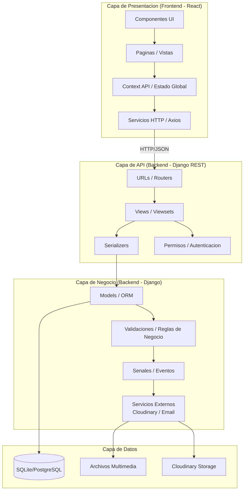
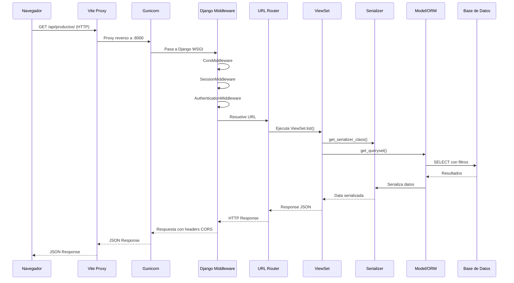

# Arquitectura General

## 16.1 Patron Arquitectonico

El sistema RED implementa una **Arquitectura de Microservicios Hibrida** complementada con el patron **MVC (Model-View-ViewSet)** en el backend y **Componentes (SPA)** en el frontend.

### Diagrama de Capas



## 16.2 Patrones de Diseno Implementados

| Patron | Implementacion | Ubicacion |
|--------|---------------|-----------|
| **MVC (Modelo-Vista-Controlador)** | Django Models (M), DRF Views/Viewsets (C), Serializers (V) | Todo el backend |
| **Repository** | Querysets de Django ORM | Models, Viewsets |
| **Singleton** | Context API de React (ThemeContext, CartContext) | Frontend |
| **Proxy** | Proxy de Vite para /api/ y /media/ | `vite.config.js` |
| **Observer** | Django Signals (validaciones en models.clean/save) | Models |
| **Strategy** | Permisos por ViewSet (AllowAny, IsAuthenticated, AdminPermission) | Viewsets |
| **Chain of Responsibility** | Middleware de Django (CORS, Session, Auth, CSRF) | `settings.py` |
| **DTO (Data Transfer Object)** | DRF Serializers | `serializers.py` de cada app |
| **Template Method** | ViewSets de DRF con metodos create/update/list/retrieve | Viewsets |
| **Factory** | `get_serializer_class()` en ViewSets | Viewsets |

## 16.3 Flujo de una Peticion Tipica



## 16.4 Estructura de una App Django

Cada aplicacion dentro del backend sigue una estructura modular consistente:

```
apps/<nombre_app>/
├── __init__.py
├── models.py           # Definicion de modelos (entidades de BD)
├── views.py            # Vistas tradicionales (no usadas mayormente)
├── admin.py            # Configuracion del admin de Django
├── apps.py             # Configuracion de la aplicacion
├── tests.py            # Pruebas unitarias
├── migrations/         # Migraciones de base de datos
│   ├── __init__.py
│   └── 0001_initial.py
└── api/                # Capa de API REST
    ├── __init__.py
    ├── serializers.py  # Serializers (DTO)
    ├── viewset.py      # Viewsets (Controladores)
    └── urls.py         # Rutas de la API
```

## 16.5 Decisiones Arquitectonicas Clave

| Decision | Alternativa | Justificacion |
|----------|------------|---------------|
| **Django en vez de FastAPI** | FastAPI, Flask | Django ofrece ORM maduro, admin integrado, migraciones, ecosistema completo para proyectos formativos |
| **DRF en vez de GraphQL** | GraphQL (Graphene) | REST es mas simple de documentar, estandar en proyectos formativos SENA, suficiente para el alcance |
| **React en vez de Next.js** | Next.js, Vue, Angular | SPA pura es suficiente (sin SSR requerido), React tiene mayor demanda laboral |
| **JWT + Sesion** | Solo JWT | El carrito necesita sesion para usuarios anonimos; JWT para autenticacion de API |
| **SQLite en desarrollo** | PostgreSQL desde inicio | SQLite no requiere instalacion de servidor, agiliza el setup inicial; migracion a PG es directa con Django ORM |
| **Microservicio 3D separado** | Integrado en frontend | El editor 3D tiene requisitos tecnicos especificos (Three.js, Tailwind) que justifican su aislamiento |
